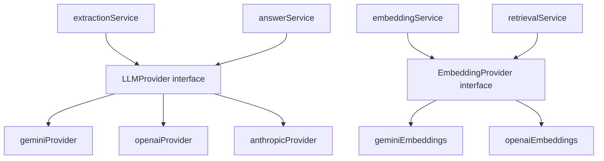
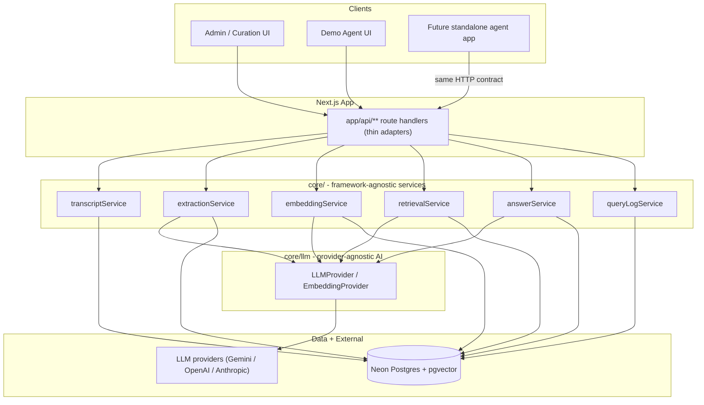
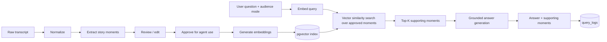
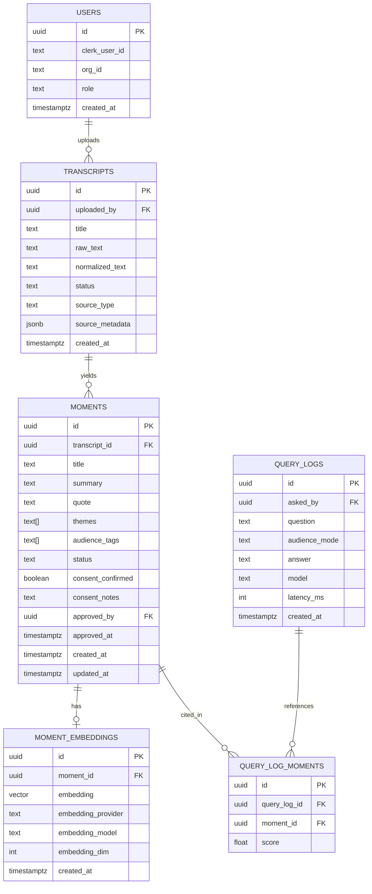

# Patient Voice Agent - Technical Architecture

> MVP for **Under the Sisterhood**. Curate lived-experience patient stories and expose a retrieval-augmented (RAG) conversational agent that answers questions grounded in approved story moments.

---

## 1. Purpose and Scope

The Patient Voice Agent lets healthcare organizations, researchers, clinicians, innovators, and policymakers interact with curated lived-experience stories. It handles the full workflow from raw transcript intake to a demo conversational agent.

Two principles drive the design:

1. **No fine-tuning.** Answers are produced via RAG over *approved* story moments. The model is never trained on story data.
2. **Governance-ready by design.** Phase 1 ignores PHI/PII, but the schema and service boundaries are built so consent, approval, privacy, and source governance can be layered in later without rework.

### Two application areas

| Area | Audience | Responsibilities |
| --- | --- | --- |
| **Admin / Curation** | Internal curators | Upload/paste transcripts, normalize, extract story moments, review/edit, approve, generate embeddings, inspect query logs |
| **Demo Agent** | External stakeholders | Ask questions, choose audience mode, retrieve approved moments, generate evidence-grounded answers, view supporting moments, log queries |

---

## 2. Tech Stack and Rationale

| Concern | Choice | Why |
| --- | --- | --- |
| Framework | **Next.js (App Router)** | Single deployable for UI + API route handlers; server components keep secrets server-side |
| Language | **TypeScript** | End-to-end type safety across services, DB, and API contracts |
| Styling | **Tailwind CSS** | Fast, consistent UI for both admin and demo surfaces |
| Auth | **Clerk** | Drop-in auth/session, gates the admin app; Clerk user/org IDs map to DB rows |
| Database | **Neon Postgres** | Serverless Postgres, fits Vercel; supports `pgvector` extension |
| Vectors | **pgvector** | Store + similarity-search embeddings inside the same DB (no separate vector store) |
| ORM | **Drizzle ORM** + `node-postgres` | Typed schema/migrations; supports a custom `vector` column for pgvector. Satisfies "Drizzle if appropriate" |
| AI | **Pluggable LLM provider** (Gemini / OpenAI / Anthropic) behind a `core/llm` interface | Extraction, embeddings, and grounded answer generation are vendor-agnostic; the provider is selected by config, not hardcoded |
| Hosting | **Vercel** | First-class Next.js deployment; env-var + edge/runtime config |

### LLM provider abstraction

All AI calls go through two thin interfaces in `core/llm`, so the rest of the codebase never depends on a specific vendor SDK. A factory reads `LLM_PROVIDER` / `EMBEDDING_PROVIDER` env vars and returns the configured adapter (see `ENVIRONMENT.md`).



Conceptual interface signatures (defined in `core/llm/types.ts`):

```typescript
interface LLMProvider {
  // Free-form grounded answer generation
  generate(input: { system?: string; prompt: string }): Promise<string>;
  // Structured/JSON output for moment extraction (schema-constrained)
  generateStructured<T>(input: { prompt: string; schema: JsonSchema }): Promise<T>;
}

interface EmbeddingProvider {
  readonly model: string;
  readonly dimension: number;
  embed(texts: string[]): Promise<number[][]>;
}
```

Per-provider default models (overridable via env):

| Task | Gemini | OpenAI | Anthropic |
| --- | --- | --- | --- |
| Moment extraction | `gemini-2.5-flash` | `gpt-4o-mini` | `claude-3-5-haiku` |
| Answer generation | `gemini-2.5-flash` (or `pro`) | `gpt-4o` | `claude-3-5-sonnet` |
| Embeddings | `gemini-embedding-001` | `text-embedding-3-small` | n/a (no first-party embeddings) |

> **Anthropic provides no first-party embeddings.** When `LLM_PROVIDER=anthropic`, you must still set an embedding-capable `EMBEDDING_PROVIDER` (Gemini or OpenAI). The two providers are configured independently.

> The embedding **dimension is provider/model-specific** and must match the `vector(N)` column in the schema. Switching embedding providers/models requires a migration and a full re-embed of approved moments. The model and dimension are driven by env vars (see `ENVIRONMENT.md`).

---

## 3. Layered Architecture

The most important architectural rule: **business logic is framework-agnostic and lives in `core/`.** Next.js route handlers are thin adapters. This lets a future standalone agent app reuse the exact same logic (either by importing the package or by calling the same HTTP contract).



### Reusability boundary

- `core/` MUST NOT import from `next/*`, React, or any request/response objects. It accepts plain typed inputs and returns plain typed outputs.
- `db/` (Drizzle schema + client) is imported by `core/`, not by route handlers directly.
- `app/api/**` validates input (e.g., Zod), checks auth (Clerk), calls a `core/` service, and serializes the result.
- Domain services (`extraction`, `answers`, `embeddings`, `retrieval`) depend only on the `core/llm` interfaces, never on a vendor SDK directly. Provider SDKs are isolated inside `core/llm/providers/*`, so adding or swapping a provider touches one folder.

---

## 4. RAG Pipeline



### Pipeline notes

- **Normalize:** strip speaker labels/timestamps noise, fix encoding, segment into clean text. Deterministic where possible; the configured `LLMProvider` is optional for cleanup.
- **Extract:** the configured `LLMProvider` returns structured moments (title, summary, verbatim quote, themes, suggested audience tags) via `generateStructured`. Stored as `draft`.
- **Review/Approve:** curators edit text and metadata; only `approved` moments are eligible for retrieval.
- **Embed:** the configured `EmbeddingProvider` embeds approved moments only (re-embedded if text changes). Stored in `moment_embeddings`.
- **Retrieve:** query embedded with the same `EmbeddingProvider`, cosine/inner-product search over approved moments, optionally filtered by audience mode/themes.
- **Generate:** the configured `LLMProvider` receives the question + retrieved moments and produces an answer that cites the moments. If retrieval is empty/weak, the agent declines rather than hallucinating.
- **Log:** every query records question, audience mode, retrieved moment IDs, answer, model, and latency.

---

## 5. Data Model

Schema is governance-ready: consent, approval, and provenance columns exist now (nullable/defaulted) even though Phase 1 does not enforce them.



### Tables

- **`users`** - maps Clerk identities to internal rows; `role` (e.g., `curator`, `admin`) and `org_id` enable later RBAC/multi-tenancy.
- **`transcripts`** - raw + normalized text, `status` (`uploaded`/`normalized`/`extracted`), and `source_type`/`source_metadata` for provenance/governance.
- **`moments`** - the curated unit. `status` enum (`draft`/`approved`/`rejected`), `themes`/`audience_tags` arrays, plus `consent_confirmed`/`consent_notes`/`approved_by`/`approved_at` for future governance and audit.
- **`moment_embeddings`** - one current embedding per approved moment; `embedding_provider` + `embedding_model` + `embedding_dim` recorded so provider/model identity is auditable and re-embedding/migration (including switching vendors) is safe. pgvector index (HNSW or IVFFlat) on `embedding`.
- **`query_logs`** + **`query_log_moments`** - full audit of demo agent usage and which moments grounded each answer (with similarity scores).

### Status enums

- Transcript: `uploaded -> normalized -> extracted`
- Moment: `draft -> approved | rejected`

---

## 6. API Surface

Route handlers are stable HTTP contracts so the future standalone agent app can call them directly. All are thin wrappers over `core/` services.

### Admin / Curation (auth required)

| Method | Path | Service | Purpose |
| --- | --- | --- | --- |
| POST | `/api/transcripts` | transcriptService.create | Upload/paste raw transcript |
| POST | `/api/transcripts/:id/normalize` | transcriptService.normalize | Normalize raw text |
| POST | `/api/transcripts/:id/extract` | extractionService.extract | Extract draft moments via the configured LLM provider |
| GET | `/api/moments` | momentService.list | List moments (filter by status/transcript) |
| PATCH | `/api/moments/:id` | momentService.update | Edit moment text/metadata |
| POST | `/api/moments/:id/approve` | momentService.approve | Approve (or reject) a moment |
| POST | `/api/moments/:id/embed` | embeddingService.embedMoment | Generate/refresh embedding |
| POST | `/api/embeddings/backfill` | embeddingService.backfill | Embed all approved-but-unembedded moments |
| GET | `/api/query-logs` | queryLogService.list | Inspect query logs |

### Demo Agent

| Method | Path | Service | Purpose |
| --- | --- | --- | --- |
| POST | `/api/agent/ask` | answerService.ask | Full RAG: embed -> retrieve -> generate -> log; returns answer + supporting moments |
| POST | `/api/agent/retrieve` | retrievalService.search | (Optional) retrieval only, for debugging/tools |

**`/api/agent/ask` response shape (conceptual):**

```json
{
  "answer": "string with grounded response",
  "audienceMode": "researcher",
  "supportingMoments": [
    { "id": "uuid", "title": "...", "quote": "...", "score": 0.82 }
  ],
  "queryLogId": "uuid"
}
```

---

## 7. Governance and Security Forward-Plan

Phase 1 assumes no PHI/PII, but the architecture reserves the seams to add it:

- **Consent:** `moments.consent_confirmed`/`consent_notes` + a future `consents` table; embedding/retrieval can be gated on consent.
- **Approval workflow:** `status` + `approved_by`/`approved_at` already gate retrieval (only `approved` moments are searchable). Add review queues/roles later.
- **Source governance:** `transcripts.source_type`/`source_metadata` capture provenance; extend with licensing and retention policy fields.
- **Privacy / PHI:** add PII detection/redaction in the normalize step, field-level encryption, and access policies. Because `core/` is the single chokepoint for data access, these controls have one place to live.
- **Auth/RBAC:** Clerk gates admin routes now; `users.role`/`org_id` enable per-org isolation and role checks later.
- **Auditability:** `query_logs` + `query_log_moments` provide an answer-provenance trail from day one.

---

## 8. Future Standalone Agent App

The future agent-only app reuses this core in one of two ways:

1. **Shared package:** extract `core/` + `db/` into a workspace package the agent app imports directly.
2. **HTTP client:** the agent app calls the existing `/api/agent/*` endpoints (with a service token), treating this app as the backend.

Either path works because business logic never depends on Next.js request/response objects.
